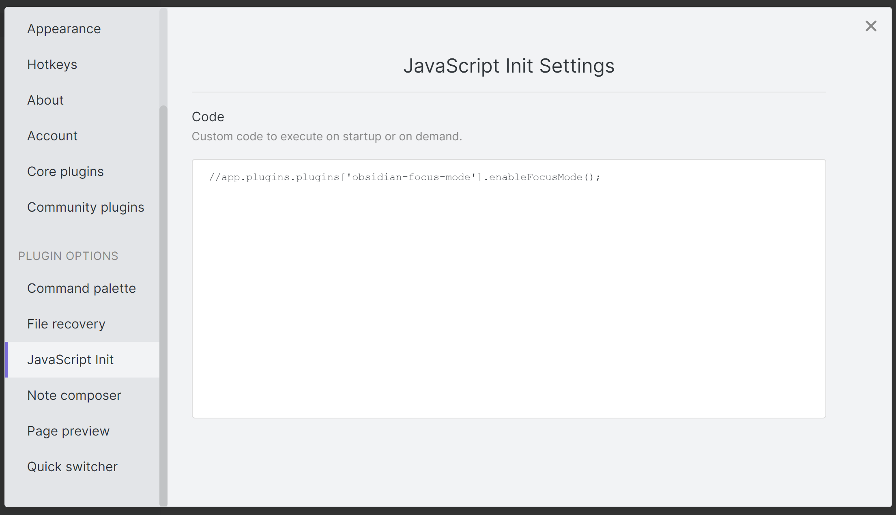

## Obsidian JavaScript Init

Run JavaScript when Obsidian loads, or any other time.

### Manually installing the plugin

-   Copy over `main.js`, `manifest.json`, and `styles.css` to your vault `VaultFolder/.obsidian/plugins/obsidian-javascript-init/`.
